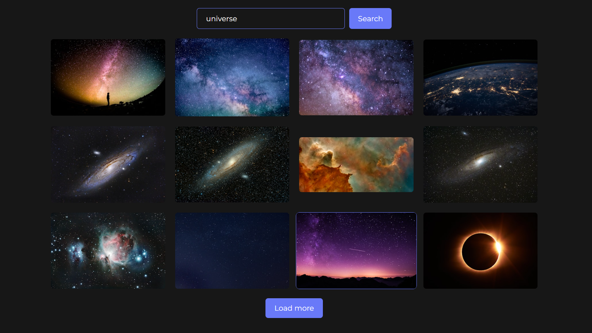

# 🔎Image Search App

This project allows users to search for images using keywords.
The user can input search queries, and the app will display relevant images from an external API.

🔗 [Live Demo](https://lensea-search-images-ds0kw8wom-sofis-projects-f6b2a04f.vercel.app/)  

### 🧾Key Features:

#### 🔹 **Image Search:**

Enter keywords in the input field to search for related images.



#### 🔹 **No Results Message:**

If no images are found for your search, a message will be displayed: "No images found for your search. Try something else!".

#### 🔹 **Empty Input Handling:**

If the input is empty, an error message will be shown.

#### 🔹 **Server Error Handling:**

In case of issues with the server response, an error message will be displayed.

#### 🔹 **Pagination:**

Only 12 images are loaded per request. If more images are available, a "Load more" button will appear. If fewer than 12 images are found, the button will not be shown.

#### 🔹 **Loader:**

A loader is displayed during image loading to enhance the user experience.

### 🔗Technologies:

- React
- Tailwind
- Image Search API

## 🚀 Run Locally

1. Clone the repository:
   ```bash
   git clone https://github.com/sofi-dobriak/lensea-search-images-app.git
2. Navigate to the project folder:
    ```bash
    cd lensea-search-images-app
3. Install dependencies:
    ```bash
    npm install
4. Start the development server:
    ```bash
    npm run dev

5. Open in your browser:
    ```bash
    http://localhost:5173

---

## 💻 My other projects

### 🎬🔍 Movies finder app

[Demo](https://movie-finder-app-three.vercel.app/) |
[Github](https://github.com/sofi-dobriak/movie-finder-app)

### 💫 Nexus — Phonebook App

[Demo](https://nexus-phonebook-app.vercel.app/) |
[Github](https://github.com/sofi-dobriak/nexus-phonebook-app)

---

👩‍💻 Author: Sofi Dobriak